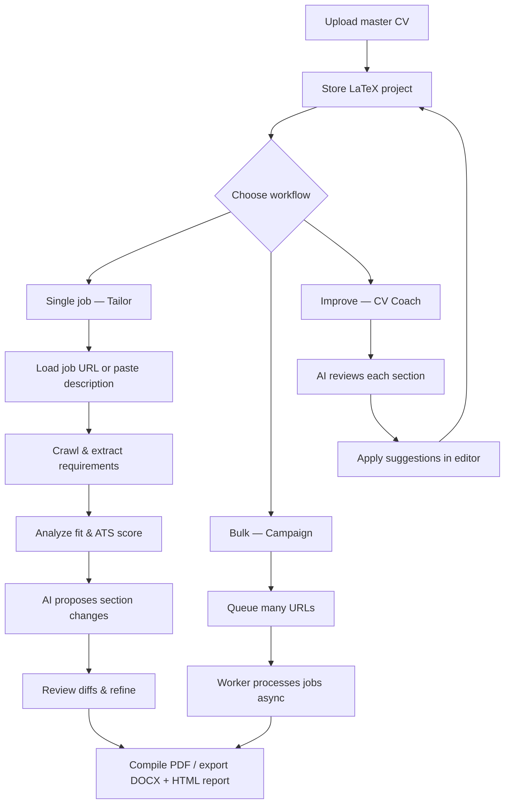
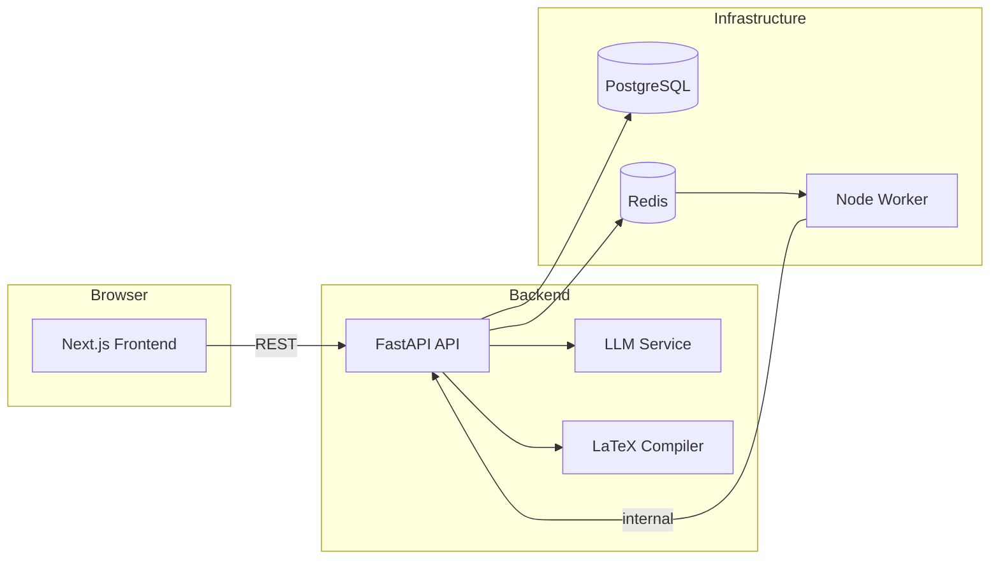

# ATS-Friendly Resume Refiner

> **ResumeForge** — tailor your LaTeX CV to any job posting with AI, without losing your design or inventing experience.

Upload your master Overleaf resume once, point it at a role, and get an ATS-optimized version with fit scoring, gap analysis, and downloadable PDF, DOCX, and HTML reports — all grounded in what you actually wrote.

---

## Table of Contents

- [About](#about)
- [What It Does](#what-it-does)
- [Who It's For](#who-its-for)
- [Features](#features)
- [How It Works](#how-it-works)
- [How to Use It](#how-to-use-it)
- [Quick Start](#quick-start)
- [Project Structure](#project-structure)
- [Tech Stack](#tech-stack)
- [Architecture](#architecture)
- [API Reference](#api-reference)
- [Configuration](#configuration)
- [Tests](#tests)
- [License](#license)

---

## About

Applying to multiple roles usually means rewriting your CV each time — reordering skills, reframing bullets, matching keywords, and hoping ATS parsers still read the file correctly. Most AI resume tools solve this by generating a generic document from scratch, which risks fabricated employers, inflated metrics, and a layout that no longer matches your personal brand.

**ATS-Friendly Resume Refiner** takes a different approach:

1. **Your LaTeX source is the source of truth** — fonts, spacing, and structure stay intact.
2. **AI edits only the sections you allow** — typically objective, skills, and experience.
3. **Every change is evidence-based** — the model rephrases and reorders what you already have; it does not invent credentials.
4. **You stay in control** — preview diffs section by section, refine with instructions, and export only when satisfied.

The result is a tailored CV that still looks like *your* CV, reads well to recruiters, and scores higher against ATS keyword checks.

---

## What It Does

| Capability | Description |
|------------|-------------|
| **Import** | Upload an Overleaf `.zip`, a PDF resume, or start from a built-in LaTeX template |
| **Understand** | Crawl job URLs or accept pasted descriptions; extract title, company, and requirements |
| **Analyze** | Score how well your CV fits a role — keyword coverage, gaps, strengths, ATS compatibility |
| **Tailor** | Rewrite allowed LaTeX sections to align with the job while preserving facts |
| **Review** | Side-by-side diff view, per-section refinement, live PDF preview |
| **Coach** | Get AI suggestions to improve your master CV before you even apply |
| **Discover** | Search job boards, save roles, and jump straight into tailoring |
| **Scale** | Run bulk campaigns across dozens or hundreds of URLs with a progress dashboard |
| **Export** | Download tailored CVs as PDF or DOCX, plus HTML fit/ATS reports |

---

## Who It's For

- **Job seekers** applying to many similar roles who need fast, truthful customization
- **LaTeX / Overleaf users** who want to keep their designed CV instead of switching to a web builder
- **Career switchers** who need to reframe the same experience for different job titles
- **Developers & engineers** running a local or self-hosted stack with full control over data and API keys
- **Recruiters & coaches** *(self-hosted)* helping candidates refine CVs with structured feedback

---

## Features

### CV Management
- Upload Overleaf LaTeX `.zip` exports — preserves design, fonts, styles, and folder structure
- Import existing PDF resumes (optional Tesseract OCR for scanned documents)
- Built-in template gallery — create from scratch or apply a template to an existing project
- Live LaTeX → PDF compilation and in-browser preview
- Section-level editor for `objective`, `skills`, `experience`, `education`, and `activities`
- Section version history with one-click restore
- Master and tailored exports in **PDF** and **DOCX**

### AI Tailoring
- **Single-job flow** — paste a URL or job description, analyze fit, preview changes, export
- **5-step wizard** — Setup → Job → Analyze → Preview → Export
- **Interactive playground** — section diffs, per-section AI refinement, master vs. proposed PDF toggle
- **Fit score** — overall match percentage with keyword hits and misses
- **ATS analysis** — parser-friendly structure, keyword density, formatting risks
- **Gap analysis** — missing skills or experience areas with honest recommendations
- **STAR bullets** — experience rewritten using Situation–Task–Action–Result framing
- **Evidence-first guardrails** — no invented employers, dates, degrees, or metrics
- **Bulk campaigns** — queue many job URLs; track pending, running, and completed jobs
- **HTML reports** — downloadable analysis with fit, ATS, gaps, and change summaries

### CV Coach
- Full-CV section review with priority-ranked suggestions (high / medium / low)
- Conversational coach chat for a target role
- Focus modes: impact & metrics, ATS keywords, STAR bullets, conciseness
- One-click apply — send a suggestion straight into the section editor

### Job Discovery
- Multi-source job search (Reed UK, Remotive, Arbeitnow, and more)
- Filter by title, location, posting age, and source
- Saved jobs inbox — bookmark listings and open them in the tailor flow
- Automatic job crawling with JSON-LD extraction and manual paste fallback

### AI Instruction Studio
- Global tailoring preferences (tone, language, constraints)
- Per-section instruction overrides
- Built-in instruction profiles for common role types
- Prompt refiner — turn rough notes into effective AI instructions

### Platform
- FastAPI backend with OpenAPI docs at `/docs`
- Next.js frontend with dark glassmorphism UI
- Redis + Node worker for async tailoring and compilation
- PostgreSQL for durable project, job, and preference storage
- Multi-tenant workspace isolation
- Full Docker Compose stack for local or server deployment

---

## How It Works



**Behind the scenes:**

1. Your LaTeX project is stored per workspace with section files intact.
2. Job text is fetched (HTTP crawl + structured data extraction) or taken from your paste.
3. The LLM receives your sections, the job description, and your instructions.
4. Only whitelisted sections are modified; education is typically left unchanged.
5. Proposed LaTeX is compiled with `pdflatex`; reports are rendered as HTML.
6. Long-running jobs are queued in Redis and executed by the Node worker.

---

## How to Use It

### 1. Set up your master CV

**Option A — Upload from Overleaf**
1. Export your Overleaf project as a `.zip`.
2. Go to **CVs** → **Upload** → drag the zip file.
3. Confirm sections are detected (`resume.tex`, `sections/*.tex`, `.sty` files).

**Option B — Start from a template**
1. Go to **CVs** → **Template**.
2. Pick a layout from the gallery and name your project.
3. Fill in sections via **Edit**.

**Option C — Import a PDF**
1. Upload a `.pdf` on the **CVs** page.
2. The backend extracts text and maps it into LaTeX sections (OCR if needed).

### 2. Tailor for one job (recommended first run)

1. Open **Tailor** (playground).
2. Select your CV project.
3. Paste a **job URL** or the full job description.
4. Click **Load job** — title, company, and requirements are extracted.
5. Click **Analyze** — review fit score, keyword gaps, and ATS notes.
6. Click **Preview** — see proposed changes per section; refine any section individually.
7. Toggle **Master / Proposed** PDF preview to compare.
8. Click **Apply & export** — download PDF, DOCX, or HTML report from **Downloads**.

### 3. Improve your master CV (CV Coach)

1. Open **Edit** and select a project.
2. Set a **target role** (e.g. "Senior AI Engineer").
3. Choose a **focus** — ATS, STAR, impact, or conciseness.
4. Run **Coach review** — prioritized suggestions appear per section.
5. Click **Apply** on a suggestion or use **Coach chat** for follow-up questions.
6. Edit LaTeX directly in the section editor; preview updates live.

### 4. Find jobs and save them

1. Open **Discover**.
2. Enter job title, location, and how recent postings should be.
3. Select job sources and search.
4. Save interesting listings to **Saved** — open any saved job in **Tailor** with one click.

### 5. Run a bulk campaign

1. Open **Campaigns**.
2. Select your CV and paste one job URL per line (or import from Discover).
3. Add optional global instructions.
4. Start the campaign — progress updates automatically.
5. Download individual tailored CVs or a batch HTML report from **Downloads**.

### 6. Configure AI behavior

1. Open **Settings** (Instruction Studio).
2. Set a **global instruction** — tone, language, constraints (e.g. "UK English, no invented experience").
3. Add **per-section overrides** — e.g. "Keep education unchanged", "Reorder skills by relevance".
4. Apply an **instruction profile** for your target industry.
5. Use **Refine prompt** to polish rough instructions.
6. Save — preferences apply to all future tailoring runs.

### Typical workflows

| Goal | Path |
|------|------|
| One application tonight | CVs → Tailor → Export PDF |
| Same CV, 20 roles this week | Discover → Campaigns → Downloads |
| CV feels weak before applying | Edit → Coach → Tailor |
| Consistent tone across all jobs | Settings → save preferences → Tailor |

---

## Quick Start

### Prerequisites

- **Python 3.11+**
- **Node.js 20+**
- **OpenAI API key**
- *(Optional)* `pdflatex` for local PDF compilation, PostgreSQL + Redis for full stack

### Local development

**Backend**
```bash
cd backend
python -m venv .venv
source .venv/bin/activate          # Windows: .venv\Scripts\activate
pip install -r requirements.txt
cp .env.example .env               # set OPENAI_API_KEY
uvicorn app.main:app --reload --port 8000
```

**Frontend**
```bash
cd frontend
npm install
cp .env.local.example .env.local
npm run dev
```

Open **http://localhost:3000**

### Docker (full stack)

```bash
export OPENAI_API_KEY=your-key
docker compose up --build
```

| Service | URL |
|---------|-----|
| App | http://localhost:3000 |
| API | http://localhost:8000 |
| Swagger docs | http://localhost:8000/docs |

---

## Project Structure

```
├── backend/                 # FastAPI API, services, DB migrations
│   ├── app/
│   │   ├── routers/         # REST endpoints (cvs, tailor, jobs, settings)
│   │   ├── services/        # LLM, tailoring, crawler, LaTeX, reports
│   │   └── db/              # SQLAlchemy models & repositories
│   └── tests/
├── frontend/                # Next.js app
│   ├── src/app/             # Pages (cvs, edit, tailor, discover, batch, …)
│   ├── src/features/        # Feature modules (coach, playground, templates)
│   └── e2e/                 # Playwright end-to-end tests
├── worker/                  # Redis queue consumer (Node.js)
├── Resume_latex/            # Reference LaTeX template
├── exports/                 # Sample tailored outputs
└── docker-compose.yml
```

### Expected LaTeX layout

```
Resume/
├── resume.tex
├── _header.tex
├── sections/
│   ├── objective.tex
│   ├── skills.tex
│   ├── experience.tex
│   ├── education.tex
│   └── activities.tex
└── TLCresume.sty
```

See `Resume_latex/` for a working example.

---

## Tech Stack

| Layer | Technologies |
|-------|-------------|
| Backend | Python, FastAPI, SQLAlchemy, Alembic, OpenAI |
| Frontend | Next.js, React, TanStack Query, Tailwind CSS |
| Worker | Node.js, BullMQ, Redis |
| Database | PostgreSQL 16 |
| CV engine | LaTeX (pdflatex), python-docx, WeasyPrint |
| Testing | pytest, Vitest, Playwright |

---

## Architecture



---

## API Reference

### CVs
| Method | Path | Description |
|--------|------|-------------|
| `GET` | `/api/cvs` | List CV projects |
| `POST` | `/api/cvs/upload` | Upload LaTeX ZIP or PDF |
| `POST` | `/api/cvs/from-template` | Create CV from template |
| `GET` | `/api/cvs/{id}/master-pdf` | Compiled master PDF |
| `PUT` | `/api/cvs/{id}/sections/{path}` | Update a LaTeX section |
| `POST` | `/api/cvs/{id}/coach/review` | CV coach section review |
| `POST` | `/api/cvs/{id}/coach/chat` | Coach chat message |

### Tailoring
| Method | Path | Description |
|--------|------|-------------|
| `POST` | `/api/tailor` | Run full tailoring job |
| `POST` | `/api/tailor/analyze` | Fit analysis only |
| `POST` | `/api/tailor/preview` | Interactive preview job |
| `POST` | `/api/crawl` | Extract job description from URL |
| `POST` | `/api/batches` | Create bulk campaign |
| `POST` | `/api/reports/html` | Download HTML report |
| `POST` | `/api/prompt/refine` | Refine AI instructions |

### Jobs & search
| Method | Path | Description |
|--------|------|-------------|
| `POST` | `/api/search` | Search job listings |
| `GET` | `/api/saved-jobs` | List saved jobs |
| `POST` | `/api/saved-jobs` | Save a job |
| `GET` | `/api/outputs` | List tailored outputs |

Full interactive docs: **http://localhost:8000/docs**

---

## Configuration

Copy `backend/.env.example` and `frontend/.env.local.example`.

| Variable | Required | Description |
|----------|----------|-------------|
| `OPENAI_API_KEY` | **Yes** | OpenAI key for tailoring, coach, and analysis |
| `OPENAI_MODEL` | No | Model name (default: `gpt-4o-mini`) |
| `DATABASE_URL` | No | PostgreSQL URL; omit for file-only dev mode |
| `REDIS_URL` | No | Redis URL for async job queue |
| `ASYNC_JOBS_ENABLED` | No | `true` to offload long jobs to the worker |
| `INTERNAL_API_KEY` | No | Shared secret between backend and worker |
| `REQUIRE_API_KEY` | No | Enforce API key on requests (production) |

**Frontend** (`frontend/.env.local`):
| Variable | Description |
|----------|-------------|
| `NEXT_PUBLIC_API_URL` | Backend API base (default: `http://127.0.0.1:8000/api`) |
| `NEXT_PUBLIC_TENANT_ID` | Workspace tenant UUID |

---

## Tests

```bash
# Backend — unit & integration
cd backend && pytest tests/ -v --cov=app --cov-report=term-missing

# Frontend — unit
cd frontend && npm test

# E2E — Playwright (Chromium)
cd frontend && npx playwright test --project=chromium
```

---

## License

Bundled LaTeX template: see `Resume_latex/LICENSE.txt`.
