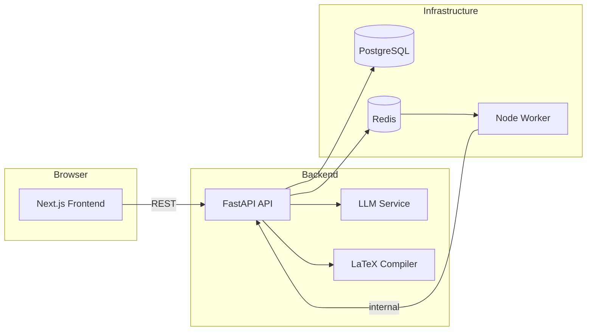

# ATS-Friendly Resume Refiner

**ResumeForge** — an AI-powered platform for tailoring Overleaf LaTeX CVs to specific job roles. Upload your master resume, match it to job postings, and generate truthful, ATS-optimized versions with fit scoring, gap analysis, and downloadable reports.

---

## Key Features

### CV Management
- **Overleaf LaTeX upload** — import a `.zip` export and preserve your design, fonts, styles, and folder structure
- **PDF import** — start from an existing PDF resume (with optional OCR for scanned documents)
- **Template gallery** — create a new CV from built-in LaTeX templates or apply a template to an existing project
- **Live PDF preview** — compile and preview your master CV without leaving the app
- **Section editor** — edit individual LaTeX sections (`experience`, `skills`, `education`, etc.) with version history and one-click restore
- **DOCX export** — download master or tailored CVs as Word documents

### AI Tailoring
- **Single-job tailoring** — paste a job URL or description and generate a role-specific CV
- **Interactive playground** — review section-by-section diffs, refine individual sections, and preview changes before export
- **Fit score & ATS analysis** — keyword coverage, gaps, strengths, and compatibility scoring
- **STAR methodology** — rewrites experience bullets using Situation–Task–Action–Result framing
- **Evidence-first editing** — AI never invents employers, credentials, dates, or metrics
- **Bulk campaigns** — queue 100+ job URLs and track progress on a batch dashboard
- **HTML reports** — downloadable fit, ATS, gap, and change-analysis reports

### CV Coach
- **Section review** — AI suggestions per section with priority labels (high / medium / low)
- **Coach chat** — conversational guidance to improve your master CV for a target role
- **Focus modes** — optimize for impact & metrics, ATS keywords, STAR bullets, or conciseness
- **One-click apply** — accept a coach suggestion and refine a section instantly

### Job Discovery
- **Multi-source search** — aggregate listings from Reed UK, Remotive, Arbeitnow, and more
- **Filters** — search by title, location, posting age, and source
- **Saved jobs inbox** — bookmark roles and jump straight into tailoring
- **Job crawling** — tiered fetch (HTTP + JSON-LD extraction) with manual paste fallback

### AI Instruction Studio
- **Global tailoring preferences** — set default tone, constraints, and emphasis
- **Per-section instructions** — override AI behavior for specific LaTeX sections
- **Prompt refiner** — polish rough instructions into effective prompts
- **Instruction profiles** — reusable presets for different role types

### Platform & Infrastructure
- **Async job queue** — Redis-backed worker for long-running tailor and compile tasks
- **PostgreSQL persistence** — CV projects, jobs, batches, and preferences stored durably
- **Multi-tenant ready** — workspace isolation with tenant-scoped storage paths
- **Docker Compose stack** — backend, frontend, worker, PostgreSQL, and Redis in one command

---

## Tech Stack

| Layer | Technologies |
|-------|-------------|
| **Backend** | Python 3, FastAPI, SQLAlchemy, Alembic, OpenAI |
| **Frontend** | Next.js, React, TanStack Query, Tailwind CSS |
| **Worker** | Node.js, BullMQ, Redis |
| **Database** | PostgreSQL 16 |
| **CV engine** | LaTeX (pdflatex), python-docx, WeasyPrint |
| **Testing** | pytest (backend), Vitest (frontend), Playwright (E2E) |

---

## Architecture



---

## Quick Start

### Backend

```bash
cd backend
python -m venv .venv
source .venv/bin/activate
pip install -r requirements.txt
cp .env.example .env
# Set OPENAI_API_KEY in .env
uvicorn app.main:app --reload --port 8000
```

### Frontend

```bash
cd frontend
npm install
cp .env.local.example .env.local
npm run dev
```

Open [http://localhost:3000](http://localhost:3000).

### Docker

```bash
export OPENAI_API_KEY=your-key
docker compose up --build
```

| Service | URL |
|---------|-----|
| Frontend | http://localhost:3000 |
| Backend API | http://localhost:8000 |
| API docs | http://localhost:8000/docs |

---

## Reference LaTeX Structure

See `Resume_latex/` for the expected project layout:

```
Resume/
├── resume.tex
├── _header.tex
├── sections/
│   ├── objective.tex
│   ├── skills.tex
│   ├── experience.tex
│   ├── education.tex
│   └── activities.tex
└── TLCresume.sty
```

---

## API Endpoints

### CVs
| Method | Path | Description |
|--------|------|-------------|
| GET | `/api/cvs` | List CV projects |
| POST | `/api/cvs/upload` | Upload LaTeX ZIP or PDF |
| POST | `/api/cvs/from-template` | Create CV from template |
| GET | `/api/cvs/{id}/master-pdf` | Download compiled master PDF |
| PUT | `/api/cvs/{id}/sections/{path}` | Update a LaTeX section |
| POST | `/api/cvs/{id}/coach/review` | Run CV coach section review |
| POST | `/api/cvs/{id}/coach/chat` | Coach chat message |

### Tailoring
| Method | Path | Description |
|--------|------|-------------|
| POST | `/api/tailor` | Run single-job tailoring |
| POST | `/api/tailor/analyze` | Analyze fit without full tailor |
| POST | `/api/tailor/preview` | Start interactive preview job |
| POST | `/api/crawl` | Extract job description from URL |
| POST | `/api/batches` | Create bulk campaign |
| POST | `/api/reports/html` | Download HTML analysis report |
| POST | `/api/prompt/refine` | Refine AI instructions |

### Jobs & Search
| Method | Path | Description |
|--------|------|-------------|
| POST | `/api/search` | Search job listings |
| GET | `/api/saved-jobs` | List saved jobs |
| POST | `/api/saved-jobs` | Save a job |
| GET | `/api/outputs` | List tailored outputs |

---

## Design

Dark navy glassmorphism UI with teal and emerald accents, DM Sans typography, and a feature-first React architecture. Navigation groups: **Work** (CVs, Edit, Tailor), **Jobs** (Discover, Saved, Campaigns), and **More** (Downloads, Settings).

---

## Tests

```bash
# Backend unit tests
cd backend && pytest tests/ -v --cov=app --cov-report=term-missing

# Frontend unit tests
cd frontend && npm test

# E2E (Playwright)
cd frontend && npx playwright test --project=chromium
```

---

## Environment Variables

Copy `backend/.env.example` and `frontend/.env.local.example`. At minimum, set:

| Variable | Required | Description |
|----------|----------|-------------|
| `OPENAI_API_KEY` | Yes | OpenAI API key for tailoring and coach |
| `OPENAI_MODEL` | No | Model name (default: `gpt-4o-mini`) |
| `DATABASE_URL` | No | PostgreSQL URL (file-only mode if omitted) |
| `REDIS_URL` | No | Redis for async jobs (disabled if omitted) |
| `ASYNC_JOBS_ENABLED` | No | Enable background worker queue |

---

## License

See `Resume_latex/LICENSE.txt` for the bundled LaTeX template license.
